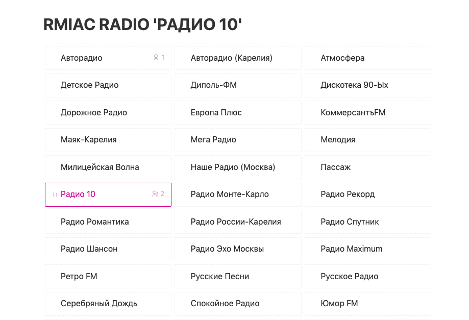

# Цель проекта

Целью проекты являлась задача по созданию html-страницы для сервера радио-вещания Icecast, на которой пользователи могли бы прослушивать потоки:



# Если всё и так устраивает

Копируем содержимое папки ```public``` в ```/usr/share/icecast2/web```, там же создаем файл ```stations.json```, описывающего icecast source:

```json
[
 {"title": "Source title 1", "url": "/source1.mp3"},
 {"title": "Source title 2", "url": "/source2.mp3"},
 {"title": "Source title 3", "url": "/source3.mp3"},
 {"title": "Source title 4", "url": "/source4.mp3"}
]
```

Открываем сервер icecast в браузере - [ICECAST_IP:3000/index.html](http://localhost:3000/index.html)

При желании меняем в ```/etc/icecast2/icecast.xml``` дефолтовую страницу ```/``` на ```index.html```:

```xml
<alias source="/" destionation="/index.html" />
```

# Установка

Ставим зависимости:

```bash
cd icecast-rmiac-radio
npm install
```

# Режим разработчика

Запускаем в консоли:

```bash
npm run dev
```

Редактируем файлы, изменения смотрим в браузере - [localhost:5000](http://localhost:5000) 

# Сборка проекта

После внесения изменений выполняем сборку проекта:

```bash
npm run build
```
